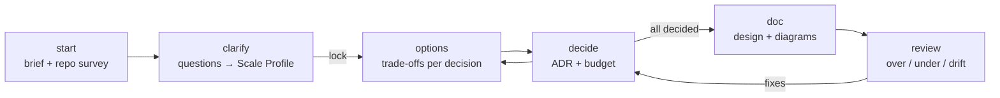

# Draftsman

**Guided, right-sized system design for AI coding agents.**

Draftsman is a plugin for AI IDEs (Claude Code, Cursor, GitHub Copilot, and others) that turns a rough idea into a right-sized system design. It asks drill-down questions, recommends stacks and patterns with explained trade-offs, lets you decide, and produces requirements, ADRs, design docs, and diagrams. The result is neither over-engineered nor under-engineered.

## Why

- A single prompt rarely produces a design that fits your requirements.
- Adding more context doesn't fix it: agents drift toward designs that are too big or too small.
- Good results depend on expert prompt-writing that most developers don't have time to learn.
- Agents pick technologies silently, without saying why or what the alternatives were.

Draftsman replaces the one-shot prompt with a structured workflow and a scoring model that the agent has to follow.

## How it works



| Step | Command | What you get |
|---|---|---|
| 1 | `/draftsman:start <idea>` | A session folder, a repo survey, and a playback of what the agent understood |
| 2 | `/draftsman:clarify` | Up to 4 rounds of focused questions, a scored **Scale Profile**, and locked requirements |
| 3 | `/draftsman:options` | 2–3 options per relevant decision, each with fit, cost, pros, cons, and a recommendation |
| 4 | `/draftsman:decide` | An ADR for each choice, with the complexity budget updated |
| 5 | `/draftsman:doc` | `design.md` with Mermaid diagrams, traceability, NFR mechanisms, and an evolution path |
| 6 | `/draftsman:review` | A right-size verdict with concrete fixes |
| any | `/draftsman:status` | Where the session stands and what to run next |

`/draftsman:start` flows straight into `clarify`, and `options` records decisions as you go, so most sessions need only `start`, `doc`, and `review`.

## The right-sizing model

Draftsman scores 8 dimensions from 0 to 3: **load, data, availability, consistency, compliance, team, integration, lifespan**. The total maps to a tier:

| Tier | Score | Complexity budget |
|---|---|---|
| T0 Prototype | 0–4 | 3 |
| T1 Simple | 5–9 | 6 |
| T2 Standard | 10–14 | 10 |
| T3 Scaled | 15–19 | 16 |
| T4 Critical | 20–24 | 24 |

Three rules follow from the score:

- **Complexity budget.** Every pattern and technology has a cost (a modular monolith is 2, microservices are 6, event sourcing is 5). Going over budget needs an ADR that names the requirement forcing it.
- **Unlock conditions.** Some patterns are flagged unless the profile justifies them. For example, microservices need at least 2 teams and either real load or a wide integration surface.
- **Baseline floor.** The minimum a design must include: secrets management, CI/CD, observability, backups, idempotency, audit logging, and more, raised by tier and by individual scores. Floor items are never cut to save budget.

Two laws drive the review:

1. **Every component traces to a requirement.** Otherwise it's over-engineering.
2. **Every requirement traces to a mechanism.** Otherwise it's under-engineering.

## Install

### Claude Code

```
/plugin marketplace add senthil-sekar/draftsman
/plugin install draftsman@draftsman
```

Or from a terminal:

```bash
claude plugin marketplace add senthil-sekar/draftsman
claude plugin install draftsman@draftsman
```

### Cursor, GitHub Copilot, and other agents

Clone this repo, then generate the files into your project (requires Node.js 18+, no packages to install):

```bash
node scripts/build-adapters.mjs --target cursor  --out /path/to/your/project
node scripts/build-adapters.mjs --target copilot --out /path/to/your/project
node scripts/build-adapters.mjs --target generic --out /path/to/your/project
```

| Target | Commands | Rules |
|---|---|---|
| `cursor` | `.cursor/commands/draftsman-*.md` → `/draftsman-start` … | `.cursor/rules/draftsman.mdc` |
| `copilot` | `.github/prompts/draftsman-*.prompt.md` → `/draftsman-start` … | `.github/instructions/draftsman.instructions.md` |
| `generic` | `.draftsman/commands/*.md` | `.draftsman/AGENTS.snippet.md` (paste into `AGENTS.md`) |

See [docs/adapters.md](docs/adapters.md) for what changes outside Claude Code.

## Example

[`examples/fnol-intake`](examples/fnol-intake) is a complete session for an auto insurance first-notice-of-loss service. It scored **T2 Standard**, turned down microservices because their unlock condition wasn't met, and finished at **8 of 10** budget points with a **RIGHT-SIZED** verdict.

## What's inside

```
.claude-plugin/     plugin.json, marketplace.json
skills/             start, clarify, options, decide, doc, review, status (commands)
                    rightsizing, design-catalog (background knowledge)
agents/             surveyor (repo scan), drafter (design author), inspector (independent reviewer)
rules/              core-rules.md: workflow gates and anti-drift rules
templates/          requirements, options, ADR, design, review, session state
scripts/            validate.mjs, build-adapters.mjs
examples/           fnol-intake
```

Session files are written to `docs/design/<slug>/` in your project, so designs are reviewed and versioned like code.

## Works with AgentAtlas

If your repo has an [AgentAtlas](https://github.com/senthil-sekar/agent-atlas) map (`SYSTEM.md` and `.agentatlas/atlas.yaml`), or the `agentatlas` MCP server is connected, the surveyor starts from it, so Draftsman designs against your real system instead of a blank slate.

## Development

```bash
npm run validate          # structural checks (no dependencies)
npm run build:adapters    # generate all adapters into ./dist
claude plugin validate . --strict
claude --plugin-dir .     # try the plugin locally
```

See [CONTRIBUTING.md](CONTRIBUTING.md) and the [roadmap](docs/roadmap.md).

## License

MIT
