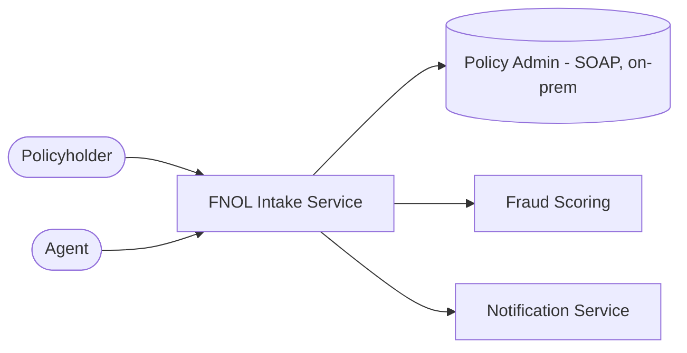
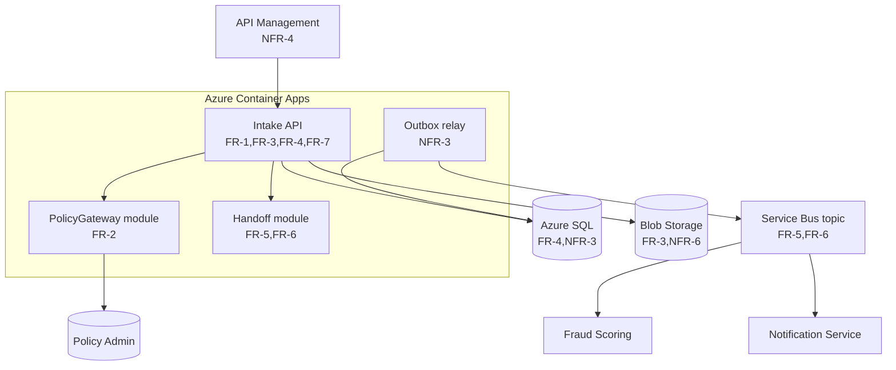
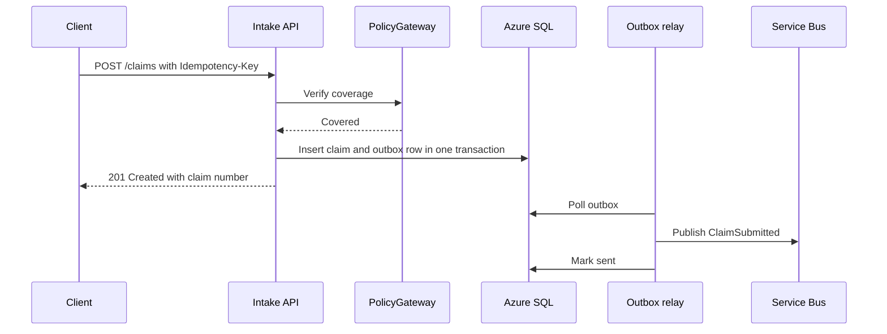

# FNOL Intake Service: Design

Profile: T2 Standard · Budget used 8 / 10 · Decisions: ADR-0001 … ADR-0006

## 1. Summary
A .NET 8 modular monolith on Azure Container Apps accepts loss reports through API Management. It verifies coverage through an anti-corruption layer over the on-premises policy system, stores claims in Azure SQL and photos in Blob Storage, and publishes `ClaimSubmitted` through a transactional outbox to Service Bus for fraud scoring and notifications.

## 2. Context diagram

## 3. Container / component view

## 4. Components
| Component | Responsibility | Technology | Cost | Traces to |
|---|---|---|---|---|
| Intake API + modules | Loss reports, photos, claim numbers, status | ASP.NET Core 8 modular monolith | 2 | FR-1, FR-3, FR-4, FR-7 |
| Hosting | Run the API and relay, zone redundant | Azure Container Apps | 1 | NFR-1 |
| PolicyGateway (ACL) | Translate and call policy admin | .NET module + Polly | 1 | FR-2, C-3 |
| Data | Claims and outbox; photos | Azure SQL; Blob Storage | 1 | FR-3, FR-4, NFR-3, NFR-6 |
| Messaging | `ClaimSubmitted` fan-out | Service Bus topic + outbox relay | 2 | FR-5, FR-6, NFR-3 |
| Edge and identity | Throttling, auth, audit | API Management; Entra External ID / Entra ID | 1 | NFR-4 |
| **Total** | | | **8** | |

## 5. Key flows
### Flow 1: Submit a loss report (FR-1, FR-2, FR-4, FR-5)

### Flow 2: Upload photos (FR-3)
The API issues a short-lived, write-only SAS URL per photo. The client uploads directly to Blob Storage, and the API records the blob reference.

## 6. Data model
`Claim` (claim number, policy number, loss date, location, status) · `Party` · `Vehicle` · `Photo` (blob URI) · `OutboxMessage`. The Intake module owns all of them; PolicyGateway stores nothing.

## 7. Non-functional mechanisms
| NFR | Mechanism | Where |
|---|---|---|
| NFR-1 | Zone-redundant Container Apps and SQL; health probes | Hosting, Data |
| NFR-2 | The synchronous path makes one policy call with an 800 ms timeout; photos bypass the API | API, PolicyGateway |
| NFR-3 | Idempotency keys; outbox written in the same transaction; Service Bus duplicate detection | API, Data, Messaging |
| NFR-4 | TDE and Blob encryption; PII field classification; APIM and SQL audit logs; Entra auth | Edge, Data |
| NFR-5 | SQL point-in-time restore (RPO ≤ 5 min); Blob soft delete; IaC redeploy (RTO 1 h) | Data, Deployment |
| NFR-6 | Blob lifecycle policy and SQL retention job, 7 years | Data |

## 8. Baseline floor
| Floor item | How it's met |
|---|---|
| Secrets out of source | Key Vault + managed identities |
| TLS | APIM and Container Apps ingress, HTTPS only |
| CI/CD with tests; IaC | GitHub Actions; Bicep |
| Structured logs, tracing, metrics | OpenTelemetry → Application Insights |
| Health endpoint; alerting on SLO | `/health`; availability and p95 alerts |
| Backups; tested restore | SQL PITR; quarterly restore drill |
| Zone redundancy; timeouts, retries, circuit breakers | Container Apps and SQL zone redundant; Polly in PolicyGateway |
| Idempotency; outbox | See NFR-3 |
| Encryption at rest; PII classification; least privilege | See NFR-4; managed identities with scoped roles |
| Audit logging; retention; access reviews | See NFR-4 and NFR-6; quarterly Entra access reviews |
| Versioned contracts; timeouts on outbound calls | `/v1` routes; 800 ms policy timeout |
| ACL for legacy; dead-letter handling; contract tests | PolicyGateway; dead-letter alerts; Pact tests with fraud scoring |
| Dev and prod environments, gated prod deploys | GitHub environments with approval |

## 9. Deployment
Single region (East US 2) with availability zones. Environments: dev and prod. Bicep modules per resource group; GitHub Actions builds, tests, and deploys, with a manual approval gate for prod.

## 10. Risks and open items
| ID | Risk / open item | Mitigation |
|---|---|---|
| R-1 | Catastrophe events spike load (A-1) | Container Apps autoscale; load test at 10x before storm season |
| R-2 | A policy admin outage blocks submissions | Accept the report as "pending verification" when the circuit is open |
| Q-1 | Fraud scoring may need photos | Add the blob reference to `ClaimSubmitted` if confirmed |

## 11. Evolution path
- **Split `Handoff` into its own service** when a second team owns fraud integration (D6 → 2).
- **Add a cache for policy lookups** when policy calls exceed 50% of submit latency.
- **Add a second region (active-passive)** if the availability target rises to 99.95% (D3 → 3).
