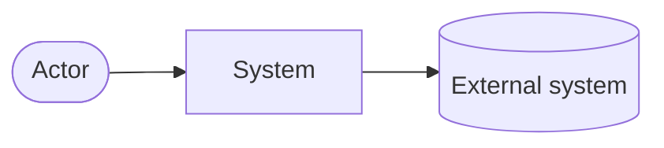
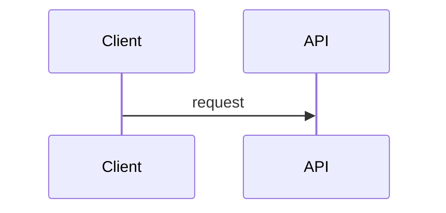

# <System name>: Design

Profile: T_ <name> · Budget used __ / __ · Decisions: ADR-0001 … ADR-000n

## 1. Summary
<Three to five sentences a new engineer could read in thirty seconds.>

## 2. Context diagram


## 3. Container / component view
```mermaid
flowchart TB
  %% Every node label ends with the requirement IDs it serves, e.g. "API<br/>FR-1,FR-2"
```

## 4. Components
| Component | Responsibility | Technology | Cost | Traces to |
|---|---|---|---|---|
| … | … | … | _ | FR-1, NFR-2 |

## 5. Key flows
### Flow 1: <name> (FR-_)


## 6. Data model
<Main entities, ownership per component, retention.>

## 7. Non-functional mechanisms
| NFR | Mechanism | Where |
|---|---|---|
| NFR-1 | … | … |

## 8. Baseline floor
| Floor item | How it's met |
|---|---|
| … | … |

## 9. Deployment
<Environments, regions/zones, IaC, pipeline.>

## 10. Risks and open items
| ID | Risk / open item | Mitigation |
|---|---|---|

## 11. Evolution path
<What would trigger the next level of architecture (for example: "split the Claims module into a service when D6 reaches 2"). This is where deferred complexity lives, instead of in the design.>
